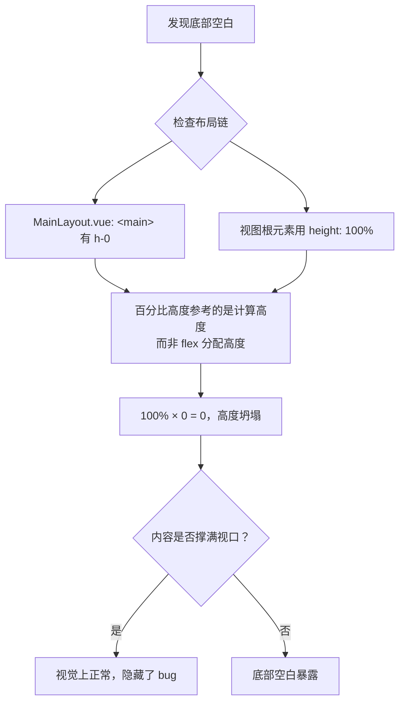

# 前端开发常见问题

## 目录

1. [底部留白：`height: 100%` 在 `<router-view>` 布局链中解析为 0](#1-底部留白height-100-在-router-view-布局链中解析为-0)

---

## 1. 底部留白：`height: 100%` 在 `<router-view>` 布局链中解析为 0

### 问题表现

调度场景页面、调度数据页面等**底部操作栏（取消 / 保存 / 下一步）下方出现空白区域**，背景图暴露出来，页面没有填满视口高度。

**对比**：调度主体页面等看起来正常，因为它们内部内容多，视觉上掩盖了高度断裂问题；内容少的页面（如调度场景的 3 张卡片）则暴露了底部空白。

### 问题根因

```
<main class="flex-1 overflow-hidden h-0 flex flex-col">   ← Tailwind h-0 = height: 0px
  <router-view class="flex-1 min-h-0" />                    ← Vue 3 不产生额外 DOM，class 直接传给子组件根
    <div class="dispatch-scenario-view" style="height: 100%">  ← 100% × 0 = 0！
      ...
    </div>
  </router-view>  <!-- 虚拟节点，不渲染 -->
</main>
```

**关键链路**：

1. `MainLayout.vue` 中 `<main>` 有 Tailwind 的 `h-0`，即 `height: 0px`
2. `<router-view class="flex-1 min-h-0">` 在 Vue 3 中**不产生额外 DOM 元素**，class 直接继承到子组件根元素
3. 子视图根元素（如 `.dispatch-scenario-view`）使用 `height: 100%`，百分比高度参考父元素 `<main>` 的**计算高度**而非 flex 分配的高度
4. `<main>` 的 `height: 0px` 导致 `100% × 0 = 0`，页面高度坍塌为 0
5. 内容多时被撑开掩盖了问题，内容少时底部空白暴露

### 分析思路



### 解决方法

**核心思路**：不依赖 `height: 100%` 百分比高度链，改用 `flex: 1` 通过 flex 分配获取实际高度。

#### 方案一：视图根元素用 `flex: 1` 替代 `height: 100%`

```css
/* ❌ 错误写法 */
.dispatch-scenario-view {
  display: flex;
  flex-direction: column;
  height: 100%;
  /* 解析为 100% × 0 = 0 */
}

/* ✅ 正确写法 */
.dispatch-scenario-view {
  display: flex;
  flex-direction: column;
  flex: 1;
  min-height: 0;
  /* flex 分配实际高度，避开百分比高度链 */
}
```

#### 方案二：同时确保中间层也用 flex 传递高度

内部容器也需要从 `height: 100%` 改为 `flex: 1`：

```css
/* ❌ 错误 */
.main-content { overflow: hidden; }          /* 非 flex 容器 */
.cards-grid { height: 100%; }                /* 百分比链断裂 */

/* ✅ 正确 */
.main-content {
  display: flex;
  flex-direction: column;
  overflow-y: auto;
}
.cards-grid {
  flex: 1;
  min-height: 0;
  grid-template-rows: 1fr;
}
```

#### 方案三：卡片内部支持溢出滚动（窗口缩小时）

```css
.sub-options {
  flex: 1;
  min-height: 0;     /* 配合 overflow 收缩 */
  overflow-y: auto;  /* 内容溢出时滚动 */
}
```

### 排查清单

当遇到类似的布局高度问题时，按以下顺序排查：

| 步骤 | 检查项 | 命令/方法 |
|------|--------|-----------|
| 1 | `<main>` 是否有 `h-0`（`height: 0px`） | 检查 `MainLayout.vue` |
| 2 | 视图根元素用 `height: 100%` 还是 `flex: 1` | 检查视图文件的 `<style scoped>` |
| 3 | 中间容器是否依赖 `height: 100%` | 逐层检查百分比高度链 |
| 4 | 是否有 `overflow` 创建 BFC 阻断高度链 | 检查 `overflow: hidden/auto` 的位置 |
| 5 | flex 容器是否设置了 `min-height: 0` | 防止 flex 子项溢出 |

### 涉及的页面/组件

修复时按此列表逐一检查：

- [ ] 调度场景 — `DispatchScenarioView.vue` ✅ 已修复
- [ ] 调度数据 — `ModelDataView.vue` ✅ 已修复
- [ ] 调度主体 — `DispatchSubjectView.vue`
- [ ] 模型算法 — `ModelAlgorithmView.vue`
- [ ] 场景约束 — `ScenarioConstraintView.vue`
- [ ] 配置汇总 — `ConfigSummaryView.vue`
- [ ] 其他所有 `height: 100%` 的视图根元素

> **注意**：Vue 3 中 `<router-view>` 是函数式组件，**不包裹额外 DOM**。写在 `<router-view>` 上的 class（如 `flex-1 min-h-0`）会直接传给子组件根元素，但 scoped CSS 的 `height: 100%` 会覆盖 `flex` 值，导致 flex 分配失效。
